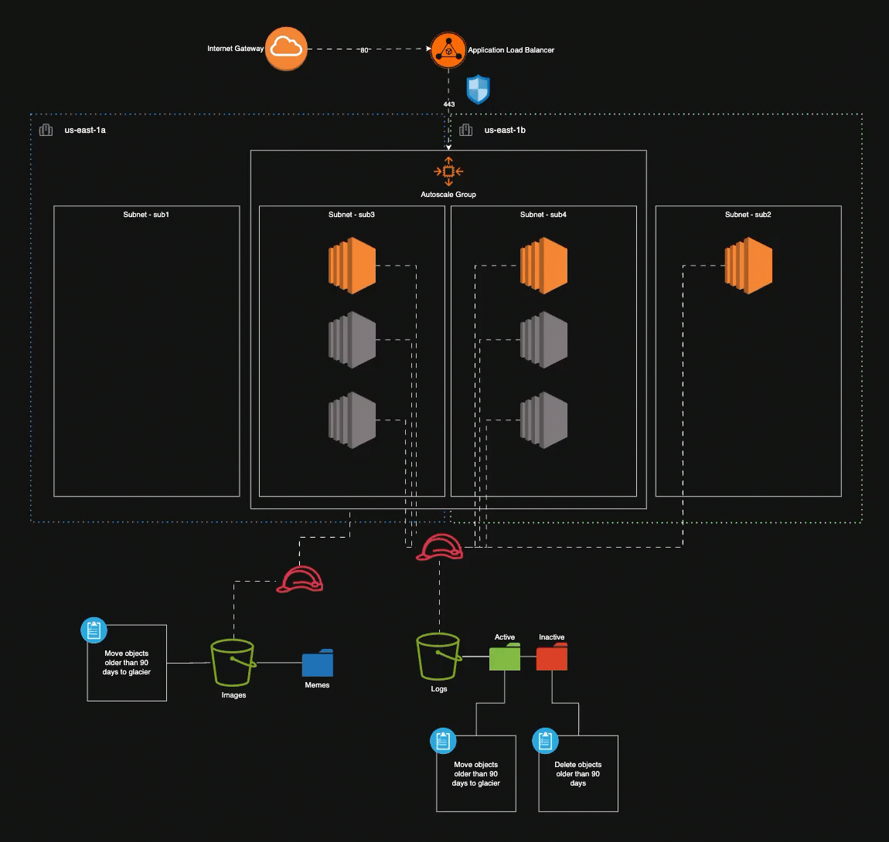

# Terraform Challenge: AWS Proof-of-Concept Environment

## Overview

This repository contains Terraform code to provision a proof-of-concept AWS environment. The configuration demonstrates best practices for Infrastructure as Code (IaC), modular design, and AWS resource provisioning.

## Architecture

The solution provisions the following:

- **VPC (10.1.0.0/16)**

  - 4 subnets across two Availability Zones:
    - **Public:**
      - Sub1 – 10.1.0.0/24
      - Sub2 – 10.1.1.0/24
    - **Private:**
      - Sub3 – 10.1.2.0/24
      - Sub4 – 10.1.3.0/24

- **Compute**

  - **Standalone EC2 instance** in Subnet 2

    - RHEL-based AMI
    - `t2.micro` instance type
    - 20 GB EBS volume
    - Used to verify connectivity and as a login point.

  - **Auto Scaling Group (ASG)** in Subnets 3 & 4
    - RHEL-based AMIs
    - `t2.micro` instances
    - 20 GB EBS volumes
    - Minimum 2, maximum 6 instances
    - Bootstrapped with Apache web server via `user_data` script
    - IAM role with permissions to read from the **Images** S3 bucket

- **Load Balancing**

  - Application Load Balancer (ALB) in public subnets
  - Listens on TCP port 80 (HTTP)
  - Forwards traffic to the ASG on port 443 (HTTPS)

- **Storage**

  - **Images Bucket**

    - Folder: `archive/`
    - Lifecycle: Move `Memes/` objects older than 90 days to Glacier.

  - **Logs Bucket**
    - Folders: `active/`, `inactive/`
    - Lifecycle:
      - `active/`: Transition objects older than 90 days to Glacier
      - `inactive/`: Expire objects older than 90 days

- **IAM**

  - IAM role for EC2 logging to write to the **Logs** bucket
  - IAM role for ASG instances to read from the **Images** bucket

- **Security**
  - Security groups for:
    - EC2 SSH access (from developer IP)
    - ALB HTTP ingress (0.0.0.0/0 on port 80)
    - ASG HTTPS ingress (restricted to ALB SG)
    - Egress rules for necessary outbound traffic

## Deliverables

- **Terraform Code**: Modular and reusable AWS IaC
- **Architecture Diagram**: Auto-generated using `inframap`
- **Documentation**:
  - This README
  - PDF write-up describing design choices and architecture

## Usage

### Prerequisites

- Terraform v1.5+
- AWS CLI configured with appropriate credentials
- An AWS account with permissions to provision VPC, EC2, ALB, S3, and IAM resources

### Steps

```bash
# Initialize Terraform
terraform init

# Validate configuration
terraform validate

# Preview changes
terraform plan -out=tfplan

# Apply infrastructure
terraform apply -var="ssh_cidr=$(curl -s https://checkip.amazonaws.com)/32" tfplan

# Destroy infrastructure when finished
terraform destroy
```

### Screenshot


### Infrastructure Diagram


